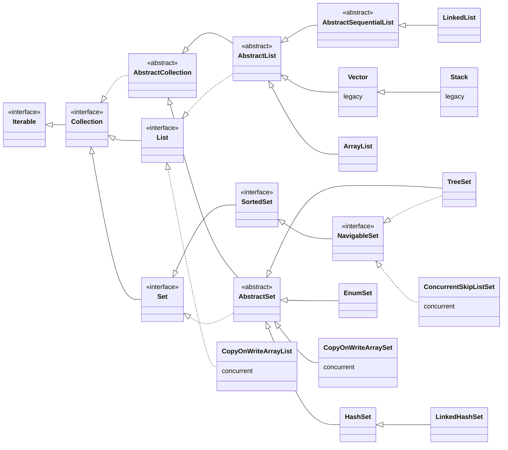
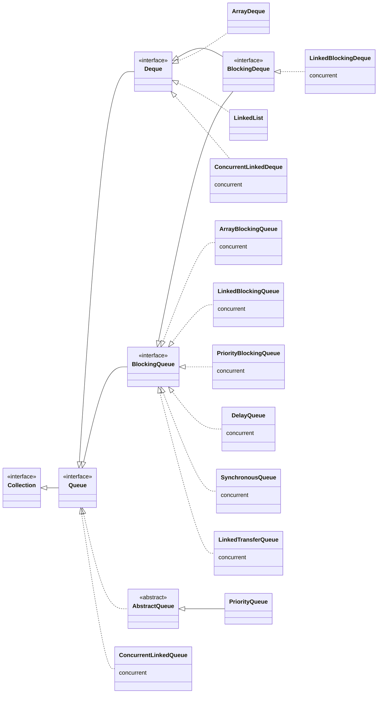
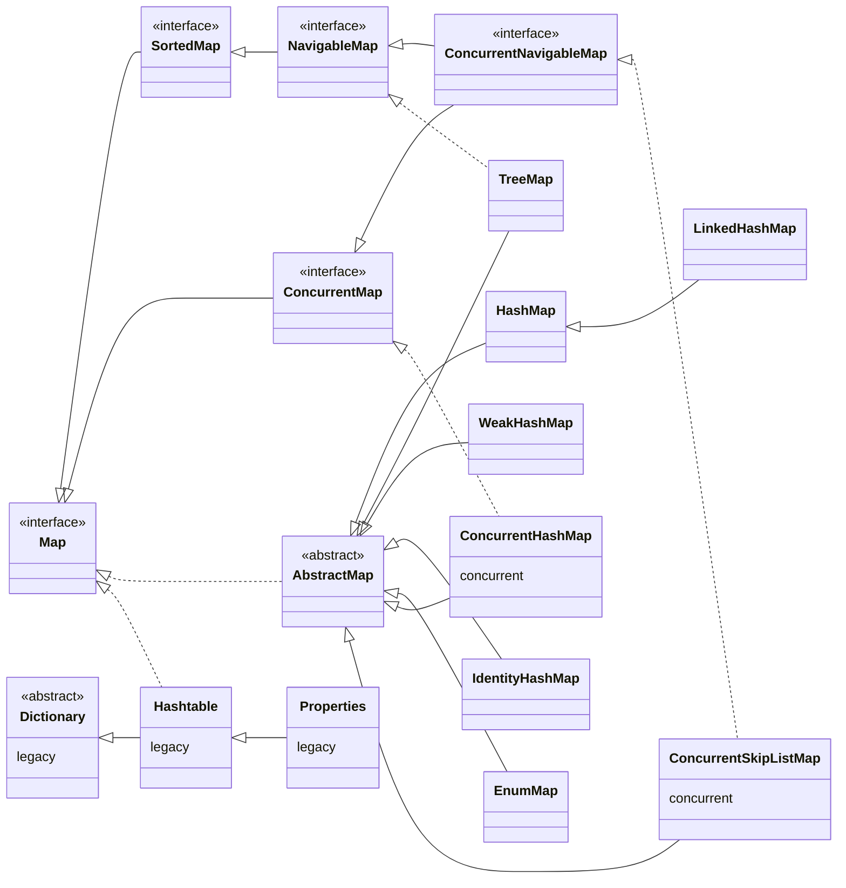

<!--
SPDX-FileCopyrightText: 2026 Bernard Ladenthin <bernard.ladenthin@gmail.com>

SPDX-License-Identifier: Apache-2.0
-->

# Java Collection Matrix

## Most Commonly Known Collections

| Collection | Ordering | Random Access | Key-Value Pairs | Allows Duplicates | Allows Null Values | Thread Safe | Blocking Operations | Upper Bounds | Usage Scenarios |
|:---|:---:|:---:|:---:|:---:|:---:|:---:|:---:|:---:|:---|
| [ArrayList](http://download.oracle.com/javase/7/docs/api/java/util/ArrayList.html) | YES | YES | NO | YES | YES | NO | NO | NO | \* Default choice of List implementation \* To store a bunch of things \* Repetitions matters \* Insertion order matters \* Best implementation in case of huge lists which are read intensive (elements are accessed more frequently than inserted deleted) |
| [HashMap](http://download.oracle.com/javase/7/docs/api/java/util/HashMap.html) | NO | YES | YES | NO | YES | NO | NO | NO | \* Default choice of Map implementation \* Majorly used for simple in-memory caching purpose. |
| [Vector](http://download.oracle.com/javase/7/docs/api/java/util/Vector.html) | YES | YES | NO | YES | YES | YES | NO | NO | \* Historical implementation of List \* A good choice for thread-safe implementation |
| [Hashtable](http://download.oracle.com/javase/7/docs/api/java/util/Hashtable.html) | NO | YES | YES | NO | NO | YES | NO | NO | \* Similar to HashMap \* Do not allow null values or keys \* Entire map is locked for thread safety |

## Most Talked About Collections

| Collection | Ordering | Random Access | Key-Value Pairs | Allows Duplicates | Allows Null Values | Thread Safe | Blocking Operations | Upper Bounds | Usage Scenarios |
|:---|:---:|:---:|:---:|:---:|:---:|:---:|:---:|:---:|:---|
| [HashSet](http://download.oracle.com/javase/7/docs/api/java/util/HashSet.html) | NO | YES | NO | NO | YES | NO | NO | NO | \* To store bunch of things \* A very nice alternative for ArrayList if \*\* Do not want repetitions \*\* Ordering does not matter |
| [TreeSet](http://download.oracle.com/javase/7/docs/api/java/util/TreeSet.html) | YES | YES | NO | NO | NO | NO | NO | NO | \* To store bunch of things in sorted order \* A very nice alternative for ArrayList if \*\* Do not want repetitions \*\* Sorted order |
| [LinkedList](http://download.oracle.com/javase/7/docs/api/java/util/LinkedList.html) | YES | NO | NO | YES | YES | NO | NO | NO | \* Sequential Access \* Faster adding and deleting of elements \* Slightly more memory than ArrayList \* Add/Remove elements from both ends of the queue \* Best alternative in case of huge lists which are more write intensive (elements added / deleted are more frequent than reading elements) |
| [ArrayDeque](http://download.oracle.com/javase/7/docs/api/java/util/ArrayDeque.html) | YES | YES | NO | YES | NO | NO | NO | NO | \* Add/Remove elements from both ends in O(1) \* Best used as a stack or queue — faster than Stack and LinkedList |
| [Stack](http://download.oracle.com/javase/7/docs/api/java/util/Stack.html) | YES | NO | NO | YES | YES | YES | NO | NO | \* Similar to a Vector \* Last-In-First-Out implementation |
| [TreeMap](http://download.oracle.com/javase/7/docs/api/java/util/TreeMap.html) | YES | YES | YES | NO | NO | NO | NO | NO | \* A very nice alternative for HashMap if sorted keys are important |

## Special Purpose Collections

| Collection | Ordering | Random Access | Key-Value Pairs | Allows Duplicates | Allows Null Values | Thread Safe | Blocking Operations | Upper Bounds | Usage Scenarios |
|:---|:---:|:---:|:---:|:---:|:---:|:---:|:---:|:---:|:---|
| [WeakHashMap](http://download.oracle.com/javase/7/docs/api/java/util/WeakHashMap.html) | NO | YES | YES | NO | YES | NO | NO | NO | \* The keys that are not referenced will automatically become eligible for garbage collection \* Usually used for advanced caching techniques to store huge data and want to conserve memory |
| [Arrays](http://download.oracle.com/javase/7/docs/api/java/util/Arrays.html) | YES | YES | NO | YES | YES | NO | NO | YES | \* A Utility class provided to manipulate arrays \*\* Searching \*\* Sorting \*\* Converting to other Collection types such as a List |
| [Properties](http://download.oracle.com/javase/7/docs/api/java/util/Properties.html) | NO | YES | YES | NO | NO | YES | NO | NO | \* Properties are exactly same as the Hashtable \* Keys and Values are String \* Can be loaded from a input stream \* Usually used to store application properties and configurations |

## Thread Safe Collections

| Collection | Ordering | Random Access | Key-Value Pairs | Allows Duplicates | Allows Null Values | Thread Safe | Blocking Operations | Upper Bounds | Usage Scenarios |
|:---|:---:|:---:|:---:|:---:|:---:|:---:|:---:|:---:|:---|
| [CopyOnWriteArrayList](http://download.oracle.com/javase/7/docs/api/java/util/concurrent/CopyOnWriteArrayList.html) | YES | YES | NO | YES | YES | YES | NO | NO | \* A thread safe variant of ArrayList \* Best use for \*\* Small lists which are read intensive \*\* requires thread-safety |
| [ConcurrentHashMap](http://download.oracle.com/javase/7/docs/api/java/util/concurrent/ConcurrentHashMap.html) | NO | YES | YES | NO | NO | YES | NO | NO | \* A thread safe variant of Hashtable \* Best use for \*\* requires thread-safety \*\* Better performance at high load due to a better locking mechanism |
| [ConcurrentSkipListMap](http://download.oracle.com/javase/7/docs/api/java/util/concurrent/ConcurrentSkipListMap.html) | YES | YES | YES | NO | NO | YES | NO | NO | \* A thread safe variant of TreeMap \* Best use for \*\* requires thread-safety |
| [ConcurrentSkipListSet](http://download.oracle.com/javase/7/docs/api/java/util/concurrent/ConcurrentSkipListSet.html) | YES | NO | NO | NO | NO | YES | NO | NO | \* A thread safe variant of TreeSet \* Best use for \*\* Do not want repetitions \*\* Sorted order \*\* Requires thread-safety |
| [CopyOnWriteArraySet](http://download.oracle.com/javase/7/docs/api/java/util/concurrent/CopyOnWriteArraySet.html) | YES | YES | NO | NO | YES | YES | NO | NO | \* A thread-safe implementation of a Set \* Best use for \*\* Small lists which are read intensive \*\* requires thread-safety \*\* Do not want repetitions |
| [ConcurrentLinkedQueue](http://download.oracle.com/javase/7/docs/api/java/util/concurrent/ConcurrentLinkedQueue.html) | YES | NO | NO | YES | NO | YES | NO | NO | \* A thread-safe unbounded FIFO queue \* Best use for \*\* Small lists \*\* No random access \*\* requires thread-safety |
| [ConcurrentLinkedDeque](http://download.oracle.com/javase/7/docs/api/java/util/concurrent/ConcurrentLinkedDeque.html) | YES | NO | NO | YES | NO | YES | NO | NO | \* A thread-safe variant of LinkedList \* Best use for \*\* Small lists \*\* No random access \*\* Insertions, retrieval on both sides of the queue \*\* requires thread-safety |

## Blocking Collections

| Collection | Ordering | Random Access | Key-Value Pairs | Allows Duplicates | Allows Null Values | Thread Safe | Blocking Operations | Upper Bounds | Usage Scenarios |
|:---|:---:|:---:|:---:|:---:|:---:|:---:|:---:|:---:|:---|
| [ArrayBlockingQueue](http://download.oracle.com/javase/7/docs/api/java/util/concurrent/ArrayBlockingQueue.html) | YES | NO | NO | YES | NO | YES | YES | YES | \* Best use for Producer - Consumer type of scenarios with \*\* Lower capacity bound \*\* Predictable capacity \* Has a bounded buffer. Space would be allocated during object creation |
| [LinkedBlockingQueue](http://download.oracle.com/javase/7/docs/api/java/util/concurrent/LinkedBlockingQueue.html) | YES | NO | NO | YES | NO | YES | YES | YES | \* Best use for Producer - Consumer type of scenarios with \*\* Large capacity bound \*\* Unpredictable capacity \* Upper bound is optional |
| [LinkedTransferQueue](http://download.oracle.com/javase/7/docs/api/java/util/concurrent/LinkedTransferQueue.html) | YES | NO | NO | YES | NO | YES | YES | NO | \* Can be used in situations where the producers should wait for consumer to receive elements. e.g. Message Passing |
| [PriorityBlockingQueue](http://download.oracle.com/javase/7/docs/api/java/util/concurrent/PriorityBlockingQueue.html) | YES | NO | NO | YES | NO | YES | YES | NO | \* Best use for Producer - Consumer type of scenarios with \*\* Large capacity bound \*\* Unpredictable capacity \*\* Consumer needs elements in sorted order |
| [LinkedBlockingDeque](http://download.oracle.com/javase/7/docs/api/java/util/concurrent/LinkedBlockingDeque.html) | YES | NO | NO | YES | NO | YES | YES | YES | \* A Deque implementation of LinkedBlockingQueue \*\* Can add elements at both head and tail |
| [SynchronousQueue](http://download.oracle.com/javase/7/docs/api/java/util/concurrent/SynchronousQueue.html) | YES | NO | NO | YES | NO | YES | YES | NO | \* Both producer and consumer threads will have to wait for a handoff to occur. \* If there is no consumer waiting. The element is not added to the collection. |
| [DelayQueue](http://download.oracle.com/javase/7/docs/api/java/util/concurrent/DelayQueue.html) | YES | NO | NO | YES | NO | YES | YES | NO | \* Similar to a normal LinkedBlockingQueue \* Elements are implementations of Delayed interface \* Consumer will be able to get the element only when it's delay has expired |

**Source:** [http://www.janeve.me/articles/which-java-collection-to-use](http://www.janeve.me/articles/which-java-collection-to-use)

---

## Type hierarchy

The same collections as the tables above, shown as a type hierarchy: the
interfaces (root `Iterable` / `Map`), the skeletal `Abstract*` classes, and the
concrete implementations, including the concurrent (`java.util.concurrent`) and
legacy types.

Relationship arrows: solid `<|--` = **extends** (class/interface inheritance),
dashed `<|..` = **implements** (a class realizing an interface).

### Collection: List & Set

### Queue & Deque

`LinkedList` implements both `List` and `Deque`; `ArrayDeque` extends
`AbstractCollection` and implements `Deque`.

### Map

`Map` is **not** a `Collection` — it is a separate root hierarchy.

### Notes

* **Legacy** (pre-Collections, Java 1.0/1.1, generally avoid): `Vector`, `Stack`,
  `Dictionary`, `Hashtable`, `Properties`, `Enumeration`. Prefer `ArrayList`,
  `ArrayDeque`, `HashMap`.
* **Concurrent** (`java.util.concurrent`): `ConcurrentHashMap`,
  `ConcurrentSkipListMap/Set`, `CopyOnWriteArrayList/Set`, the `BlockingQueue`
  family. Use these instead of `Collections.synchronizedXxx(...)` wrappers under
  contention.
* `EnumSet` / `EnumMap` are highly efficient specializations for enum keys.
* `Collections` and `Arrays` (utility classes, e.g. `Arrays` in the table above)
  and `Iterator` / `ListIterator` are part of the framework but are not
  collection types, so they are not shown in the hierarchy.
