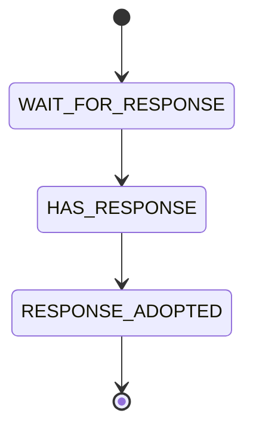

<!--
SPDX-FileCopyrightText: 2026 Bernard Ladenthin <bernard.ladenthin@gmail.com>

SPDX-License-Identifier: Apache-2.0
-->

# Speak Better Java

A concise summary of Java best-practice techniques, with short examples. Two
parts: **collections & hashing fundamentals**, and **writing safer, cleaner
Java** — common mistakes, `final`, the memory model, encapsulation &
immutability, and a few patterns.

## Collections & hashing

### Override `equals()` and `hashCode()` together

If two objects are equal they **must** return the same hash code, or they break
in `HashMap`/`HashSet`. Override both, over the same fields. Since Java 7 use
`Objects.equals(...)` / `Objects.hash(...)`.

```java
public final class CartesianPosition {
    private final double x;
    private final double y;

    @Override
    public boolean equals(Object obj) {
        if (this == obj) return true;
        if (obj == null || getClass() != obj.getClass()) return false;
        CartesianPosition other = (CartesianPosition) obj;
        return Double.compare(x, other.x) == 0
            && Double.compare(y, other.y) == 0;
    }

    @Override
    public int hashCode() {
        return Objects.hash(x, y);
    }
}
```

`hashCode` is a cheap pre-filter: it selects a bucket so that the expensive
`equals` only runs against the few keys that share it.

### What makes a good hash function

A hash maps a large input to a small fixed-size value, so collisions are
unavoidable once the output space is smaller than the input space. Aim for:

- **Deterministic** — same input, same hash.
- **Uniform distribution / low collision rate.** A naïve byte sum is bad: for
  `{0,3}`, `{1,2}`, `{2,1}`, `{3,0}` it always yields `3`.
- **Efficient** and cheap to compute.

### Choose the right collection

For the full type hierarchy and a feature comparison see
[`java-collection-matrix.md`](java-collection-matrix.md).
The everyday choice is `ArrayList` vs `ArrayDeque` vs `LinkedList`:

| Operation | `ArrayList` | `ArrayDeque` | `LinkedList` |
|---|:---:|:---:|:---:|
| Add / remove at **front** | O(n) | O(1) | O(1) |
| Add / remove at **back** | O(1)\* | O(1) | O(1) |
| **Random access** (`get(i)`) | O(1) | O(1) | O(n) |
| Insert / delete at an iterator | O(n) | O(n) | O(1) |
| Good for | lists, random access | stacks & queues | frequent middle edits |

\* amortized. Rules of thumb: **default to `ArrayList`** (best random access and
cache locality); use **`ArrayDeque`** for stacks/queues (faster than the legacy
`Stack` and than `LinkedList`); reach for **`LinkedList`** only when you insert
or delete in the middle through an iterator a lot.

Maps: `HashMap` (unordered, not synchronized), `LinkedHashMap` (keeps
insertion/access order), `TreeMap` (sorted by key), `Hashtable` (legacy,
synchronized — avoid).

### Arrays are always mutable

An array object is mutable even if its element type is immutable — any holder of
the reference can overwrite elements. There is no such thing as an immutable
array; wrap it (see [Wrap `byte[]`](#wrap-byte-in-an-immutable-view)) if you need
immutability.

## Writing better Java

### Compare objects with `.equals()`, not `==`

`==` compares references (identity); use `.equals()` for value equality.

```java
if ((abc + def).equals("abcdef")) { ... }   // correct
if ((abc + def) == "abcdef")      { ... }   // wrong: reference identity
```

### Everything is pass-by-value

Java passes **references by value**. A method can mutate the object a reference
points to, but reassigning the parameter never affects the caller.

```java
Object x = null;
giveMeAString(x);
System.out.println(x);          // prints null, NOT "This is a string"

static void giveMeAString(Object y) {
    y = "This is a string";     // rebinds the local copy only
}
```

### Never swallow exceptions

An empty or print-and-continue `catch` hides failures. Handle it, rethrow it, or
at least log it with the stack trace — never leave the block blank.

```java
try {
    ...
} catch (IOException e) {
    throw new UncheckedIOException(e);   // don't just System.out.println(e)
}
```

### Prefer `final`

A `final` variable is assigned exactly once. A **blank final** field must be
definitely assigned on every path — so the compiler catches a missing branch for
you:

```java
final Object weather;
if (isRainy())      weather = new RainyDay();
else if (isSunny()) weather = new SunnyDay();
else                throw new IllegalStateException("unknown weather");
System.out.println(weather);
```

`final` on a **reference** prevents rebinding, not mutation of the referenced
object. Initialize `final` fields at their declaration when you can:

```java
private final Logger log = LoggerFactory.getLogger(getClass());
```

### `final` classes: only for performance

A `final` class can't be subclassed, so its methods need no virtual-dispatch
table and calls are marginally faster. But it also forbids inheritance — the
opposite of open, object-oriented design. Use it only when performance is
genuinely the priority, not by default.

### Access modifiers

| Modifier | Class | Package | Subclass | World |
|---|:---:|:---:|:---:|:---:|
| `public` | ✅ | ✅ | ✅ | ✅ |
| `protected` | ✅ | ✅ | ✅ | ❌ |
| *(default)* | ✅ | ✅ | ❌ | ❌ |
| `private` | ✅ | ❌ | ❌ | ❌ |

Note: `private` restricts access **per class, not per object** — a method may
read another instance's private fields of the same class.

### The Java Memory Model (JSR-133)

Each thread may work on a cached copy of a shared variable. Without `volatile` or
`synchronized`, a write in one thread may never become visible to another, and
the JIT is free to reorder or keep values in registers:

```java
static boolean keepRunning = true;               // add 'volatile' to fix

new Thread(() -> { while (keepRunning) { } }).start();
Thread.sleep(1000);
keepRunning = false;                             // thread may loop forever without volatile
```

- **`volatile`** guarantees visibility — reads and writes go to main memory.
- **`synchronized`** establishes a happens-before barrier: everything written
  before a lock is released is visible to the next thread that acquires it.

```java
public final class Counter {
    private int count = 0;
    public synchronized void set(int amount) { count = amount; }
    public synchronized int get()            { return count; }
}
```

Don't "optimize" by synchronizing only the write and not the read — an
unsynchronized reader may never see the update, or may read a half-written value.

### Encapsulation & immutability

Getters and setters are overused: a class that merely exposes its fields through
`getX`/`setX` has weak encapsulation. Prefer real behavior and immutability.

Weak — mutable, leaks its representation, not thread-safe:

```java
public class Money {
    private double amount;
    public double getAmount()            { return amount; }
    public void setAmount(double amount) { this.amount = amount; }
}
```

Strong — immutable, thread-safe, operations return new values:

```java
public final class Money {
    private final BigDecimal amount;
    public Money(String amount)   { this.amount = new BigDecimal(amount); }
    public Money add(Money toAdd) { return new Money(amount.add(toAdd.amount).toString()); }
    public String getAmount()     { return amount.toString(); }
}
```

**Default to immutable objects.** They:

- are simple to build, test and reason about;
- are automatically thread-safe, with no synchronization;
- need no defensive copies, copy constructors or `clone`;
- make safe `Map` keys and `Set` elements (their state can't drift while stored);
- can cache `hashCode` / `toString` lazily;
- have *failure atomicity* — a thrown exception never leaves them half-updated.

> "Classes should be immutable unless there's a very good reason to make them
> mutable… If a class cannot be made immutable, limit its mutability as much as
> possible." — Joshua Bloch, *Effective Java*

Lazy, cached `hashCode` on an immutable type:

```java
private transient Integer lazyHashCode;

@Override
public int hashCode() {
    if (lazyHashCode == null) {
        lazyHashCode = Objects.hash(super.hashCode(), disseminationArea);
    }
    return lazyHashCode;
}
```

### Assertions

Use assertions (`-ea`) for conditions that must always hold; use exceptions for
real error handling.

```java
assert !aliensOnEarth : "They're killing me!";
```

### Singletons

Prefer one `private static final` instance over scattering `new`:

```java
public final class Broadcast {
    private static final Broadcast INSTANCE = new Broadcast();
    private Broadcast() { }
    public static Broadcast getInstance() { return INSTANCE; }
}
```

If the singleton is immutable, the usual singleton worries (shared mutable state,
thread-safety) largely disappear.

### Model state with an enum state machine

Encode the allowed transitions in the enum and validate them in one place, so an
illegal transition can't happen silently:

```java
private enum State {
    WAIT_FOR_RESPONSE { public Set<State> next() { return EnumSet.of(HAS_RESPONSE); } },
    HAS_RESPONSE      { public Set<State> next() { return EnumSet.of(RESPONSE_ADOPTED); } },
    RESPONSE_ADOPTED;
    public Set<State> next() { return EnumSet.noneOf(State.class); }
}

private synchronized void setState(State target) {
    if (!state.next().contains(target)) {
        throw new IllegalStateException(state + " -> " + target);
    }
    state = target;
}
```



### Wrap `byte[]` in an immutable view

`byte[]` is mutable and leaks. Wrap it so callers only get read-only access
(copy on the way in, hand out read-only buffers on the way out):

```java
public final class B {
    private final ByteBuffer buffer;

    public B(byte[] array) { buffer = ByteBuffer.wrap(array.clone()); }

    public ByteBuffer view() { return buffer.asReadOnlyBuffer(); }

    public void writeTo(OutputStream out) throws IOException {
        Channels.newChannel(out).write(buffer.asReadOnlyBuffer());
    }
}
```

For heavy I/O a direct `ByteBuffer` often out-throughputs a plain `byte[]`.
