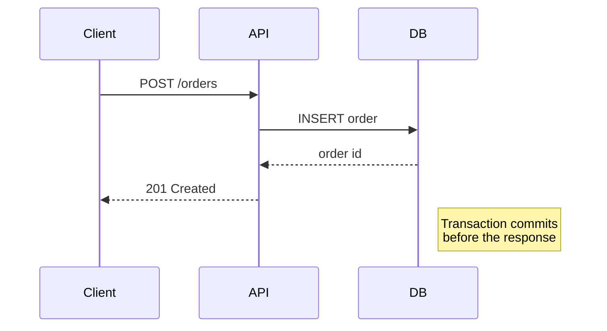
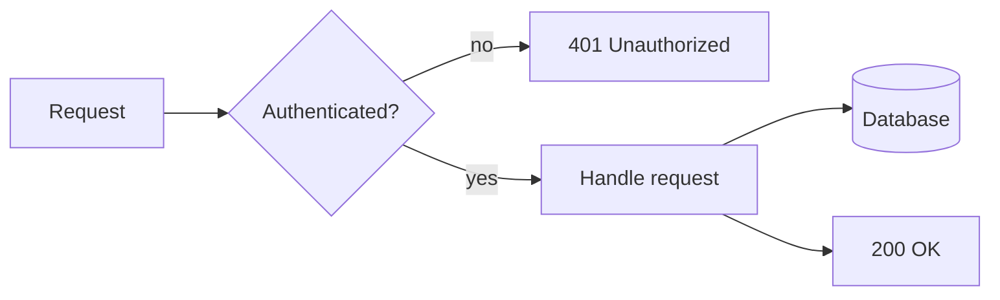
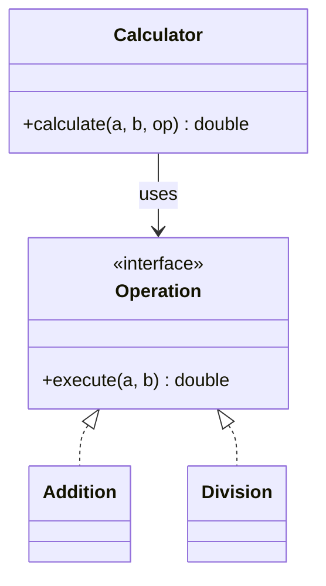

<!--
SPDX-FileCopyrightText: 2026 Bernard Ladenthin <bernard.ladenthin@gmail.com>

SPDX-License-Identifier: Apache-2.0
-->

# Interview preparation — CS fundamentals refresher

Compact refresher for technical interviews: complexity notation, the classic
algorithm questions, data-structure trade-offs, the acronym round
(SOLID/CRUD/ACID/REST), a regex cheat sheet, and UML sketching.

Java-specific depth lives next door and is not repeated here:

- [`Java/speak-better-java.md`](../../Java/speak-better-java.md) — `equals`/`hashCode`,
  pass-by-value, the memory model, immutability, patterns.
- [`Java/java-collection-matrix.md`](../../Java/java-collection-matrix.md) —
  feature-by-feature collection comparison and type hierarchy.

## Contents

- [Complexity notation](#complexity-notation)
- [Fibonacci — the recursion question](#fibonacci--the-recursion-question)
- [Sorting](#sorting)
- [Data structures](#data-structures)
- [SOLID](#solid)
- [CRUD, ACID, REST](#crud-acid-rest)
- [A typical coding task: max latency per e-mail](#a-typical-coding-task-max-latency-per-e-mail)
- [Regex in Java](#regex-in-java)
- [Keywords interviewers like](#keywords-interviewers-like)
- [UML sketching](#uml-sketching)

## Complexity notation

Complexity bounds describe how a **resource** — runtime *or* memory — grows with
the input size *n*. Always say which one you mean; "O(n log n)" alone is
ambiguous.

| Notation | Bound | Reading |
|----------|-------|---------|
| `O(f)` | upper | grows **at most** as fast as *f* — worst case |
| `Ω(f)` | lower | grows **at least** as fast as *f* — best case |
| `Θ(f)` | both | grows **exactly** in the order of *f* |

Common growth classes, ascending:

| Class | Name | Typical example |
|-------|------|-----------------|
| `O(1)` | constant | array index access, `HashMap.get` (average) |
| `O(log n)` | logarithmic | binary search, balanced-tree lookup |
| `O(n)` | linear | single pass over a list |
| `O(n log n)` | linearithmic | comparison sorts (merge, heap, TimSort) |
| `O(n²)` | quadratic | nested loops, bubble/insertion sort |
| `O(2ⁿ)` | exponential | naive recursion over subsets |

**Amortized** complexity is worth naming: a single `ArrayList.add` can be `O(n)`
when the backing array is resized, but the *average over many adds* is `O(1)`,
because capacity doubles.

## Fibonacci — the recursion question

### Naive recursion

```java
public long fib(int n) {
    if (n < 2) {
        return n;
    }
    return fib(n - 1) + fib(n - 2);
}
```

- **Time:** `Θ(φⁿ)` with φ ≈ 1.618 — every call spawns two more until the base
  case. `O(2ⁿ)` is the loose upper bound usually quoted; the golden-ratio answer
  is the precise one.
- **Space:** `O(n)` — maximum call-stack depth (from *n* down to 0).

### Recursion with memoization

```java
private final Map<Integer, Long> cache = new HashMap<>();

public long fib(int n) {
    if (n < 2) {
        return n;
    }
    Long cached = cache.get(n);
    if (cached != null) {
        return cached;
    }
    long result = fib(n - 1) + fib(n - 2);
    cache.put(n, result);
    return result;
}
```

- **Time:** `O(n)` — every value is computed once.
- **Space:** `O(n)` — cache entries plus stack depth.
- Use `long`, not `int`: `fib(47)` already overflows a 32-bit `int`. Beyond
  `fib(92)` even `long` overflows — that is `BigInteger` territory.
- One `get` instead of `containsKey` + `get` halves the lookups.

### Iterative — the answer they usually want

```java
public long fib(int n) {
    long previous = 0;
    long current = 1;
    for (int i = 0; i < n; i++) {
        long next = previous + current;
        previous = current;
        current = next;
    }
    return previous;
}
```

- **Time:** `O(n)`, **Space:** `O(1)` — no stack, no cache.

## Sorting

### Bubble sort

Repeatedly walks the list, swapping adjacent elements that are out of order. The
`swapped` flag matters: without it, an already-sorted array still costs `O(n²)`.

```java
public void bubbleSort(int[] array) {
    for (int i = 0; i < array.length - 1; i++) {
        boolean swapped = false;
        for (int j = 0; j < array.length - 1 - i; j++) {
            int next = j + 1;
            if (array[j] > array[next]) {
                int temp = array[j];
                array[j] = array[next];
                array[next] = temp;
                swapped = true;
            }
        }
        if (!swapped) {
            return; // already sorted
        }
    }
}
```

- **Time:** `O(n²)` average and worst, `O(n)` best case (with the flag).
- **Space:** `O(1)` — sorted in place.

### Quick sort

```java
public void quickSort(int[] array, int left, int right) {
    if (left < right) {
        int pivotIndex = partition(array, left, right);
        quickSort(array, left, pivotIndex - 1);
        quickSort(array, pivotIndex + 1, right);
    }
}

private int partition(int[] array, int left, int right) {
    int pivot = array[right];
    int i = left - 1;
    for (int j = left; j < right; j++) {
        if (array[j] <= pivot) {
            i++;
            swap(array, i, j);
        }
    }
    swap(array, i + 1, right);
    return i + 1;
}

private void swap(int[] array, int a, int b) {
    int temp = array[a];
    array[a] = array[b];
    array[b] = temp;
}
```

- **Time:** `O(n log n)` average — each recursion level touches every element
  once. Worst case `O(n²)` when the pivot is always the smallest or largest
  element (e.g. an already-sorted array with a fixed pivot). Avoided by a random
  pivot or median-of-three.
- **Space:** `O(log n)` average call-stack depth, `O(n)` worst case. Sorting is
  in place — no extra arrays.
- Recursing into the **smaller** partition first and looping on the larger one
  caps stack depth at `O(log n)` even in the worst case. Note that Java has **no
  tail-call optimization** — that loop has to be written by hand:

  ```java
  while (left < right) {
      int pivotIndex = partition(array, left, right);
      if (pivotIndex - left < right - pivotIndex) {
          quickSort(array, left, pivotIndex - 1);
          left = pivotIndex + 1;          // iterate on the larger side
      } else {
          quickSort(array, pivotIndex + 1, right);
          right = pivotIndex - 1;
      }
  }
  ```

### Comparison

| Algorithm | Average | Worst | Space | Stable | Note |
|-----------|---------|-------|-------|--------|------|
| Bubble | `O(n²)` | `O(n²)` | `O(1)` | yes | teaching only |
| Insertion | `O(n²)` | `O(n²)` | `O(1)` | yes | fast for small/nearly-sorted input |
| Merge | `O(n log n)` | `O(n log n)` | `O(n)` | yes | predictable, needs a buffer |
| Heap | `O(n log n)` | `O(n log n)` | `O(1)` | no | in place, poor cache locality |
| Quick | `O(n log n)` | `O(n²)` | `O(log n)` | no | fastest in practice |

In the JDK: `Arrays.sort(int[])` uses **dual-pivot quicksort**;
`Arrays.sort(Object[])` and `Collections.sort` use **TimSort** — stable,
`O(n log n)` worst case, and `O(n)` on already-sorted input.

## Data structures

| Structure | Access | Search | Insert/Delete | Note |
|-----------|--------|--------|---------------|------|
| Array / `ArrayList` | `O(1)` | `O(n)` unsorted, `O(log n)` sorted (binary search) | `O(n)` in the middle, amortized `O(1)` at the end | contiguous, cache-friendly |
| `LinkedList` | `O(n)` | `O(n)` | `O(1)` *given the node* | rarely the right answer in practice |
| `HashMap` / `HashSet` | — | `O(1)` average | `O(1)` average | see the worst-case note below |
| `TreeMap` / `TreeSet` | — | `O(log n)` | `O(log n)` | red-black tree, keeps keys sorted |
| Stack | — | `O(n)` | `O(1)` | LIFO — parsing, backtracking, undo |
| Queue / `ArrayDeque` | — | `O(n)` | `O(1)` | FIFO — scheduling, BFS |
| Binary search tree | — | `O(log n)` balanced, `O(n)` degenerate | `O(log n)` balanced | balancing is what makes the bound hold |

**`HashMap` worst case:** the classic answer is `O(n)` when all keys collide into
one bucket. Since **Java 8** a bucket that exceeds 8 entries is converted into a
red-black tree, so the worst case is `O(log n)` when the keys are `Comparable` —
a good detail to drop, and the reason `equals`/`hashCode` quality matters.

**Tree traversals** they may ask you to write: in-order (left, node, right — for
a BST this yields sorted output), pre-order (node, left, right — for copying a
tree), post-order (left, right, node — for freeing/aggregating bottom-up),
level-order (BFS with a queue).

## SOLID

Guidelines for maintainable object-oriented code.

- **S — Single Responsibility:** a class should have only one reason to change
  (business logic separated from file I/O).
- **O — Open/Closed:** open for extension, closed for modification (add a new
  implementation of an interface instead of editing a `switch`).
- **L — Liskov Substitution:** a subclass must be usable wherever its base class
  is, without breaking expectations (the classic violation: `Square extends
  Rectangle`).
- **I — Interface Segregation:** several small, specific interfaces beat one
  large one — no class should be forced to implement methods it does not need.
- **D — Dependency Inversion:** high-level modules should not depend on low-level
  ones; both depend on abstractions (constructor injection over `new` in the
  middle of business logic).

## CRUD, ACID, REST

### CRUD

The four basic operations on persistent data:

| Letter | Operation | SQL | HTTP |
|--------|-----------|-----|------|
| **C** | Create | `INSERT` | `POST` |
| **R** | Read | `SELECT` | `GET` |
| **U** | Update | `UPDATE` | `PUT` / `PATCH` |
| **D** | Delete | `DELETE` | `DELETE` |

`PUT` replaces the whole resource, `PATCH` modifies parts of it.

### ACID

Guarantees for reliable transaction processing:

- **A — Atomicity:** all-or-nothing; either every change is applied or none is.
- **C — Consistency:** the database moves from one valid state to another —
  constraints, relations and triggers hold before and after.
- **I — Isolation:** concurrent transactions must not observe each other's
  intermediate state (locks or MVCC). The isolation *levels* — read uncommitted,
  read committed, repeatable read, serializable — and the anomalies they permit
  (dirty read, non-repeatable read, phantom read) are the standard follow-up.
- **D — Durability:** committed changes survive a crash (write-ahead log, fsync).

Used to judge relational databases (PostgreSQL, MySQL/InnoDB). The counterpart
in distributed NoSQL systems is **BASE** (Basically Available, Soft state,
Eventually consistent).

### REST

- Stateless: every request carries everything the server needs — no session
  state in between.
- Resource-oriented, predictable URLs: `/users/42/orders`, not
  `/getUserOrders?id=42`.
- Uses HTTP verbs and status codes as intended: `200`, `201 Created`,
  `400 Bad Request`, `401` vs `403`, `404`, `409 Conflict`, `500`.
- `GET`, `PUT`, `DELETE` are **idempotent**; `POST` is not. `GET` must also be
  *safe* — no side effects.

## A typical coding task: max latency per e-mail

Parse CSV text, then report the highest latency per e-mail address.

```java
import java.util.*;

public class MaxLatencyPerEmail {

    record LatencyRecord(String timestamp, String email, int latency) {}

    public static void main(String[] args) {
        String text = """
                timestamp,email,latency
                20260829-001500,user1@example.com,875
                20260829-002500,user3@example.com,220
                20260829-010800,user1@example.com,647
                20260829-020300,user2@example.com,238
                20260829-023900,user3@example.com,408
                20260829-024500,user4@example.com,442
                20260829-025200,user5@example.com,452
                20260829-025700,user1@example.com,319
                20260829-030000,user2@example.com,943
                20260829-030400,user4@example.com,392
                20260829-032200,user1@example.com,604
                20260829-033300,user2@example.com,402
                """;

        String[] lines = text.strip().split("\\R");

        // One pass, keeping the maximum per e-mail: O(n) time, O(k) memory.
        Map<String, LatencyRecord> maxByEmail = new LinkedHashMap<>();
        for (int i = 1; i < lines.length; i++) { // skip the header
            String[] parts = lines[i].split(",");
            LatencyRecord current =
                    new LatencyRecord(parts[0], parts[1], Integer.parseInt(parts[2]));
            maxByEmail.merge(current.email(), current,
                    (a, b) -> a.latency() >= b.latency() ? a : b);
        }

        maxByEmail.values().forEach(r -> System.out.println(
                r.email() + " -> max latency: " + r.latency() + " at " + r.timestamp()));
    }
}
```

Points to make while writing it:

- **Text blocks:** the closing `"""` must sit at the same indentation as the
  content lines. If it is indented *less*, that difference stays in the string as
  leading whitespace on every line — and `strip()` only trims the ends of the
  whole string, not each line. A silent source of "why is my first column
  broken?".
- **Complexity:** sorting everything and then skipping duplicates costs
  `O(n log n)`; the one-pass `merge` above is `O(n)`. Say so — that is what the
  question is testing.
- If sorting *is* asked for, prefer a `Comparator` over implementing
  `Comparable`: `records.sort(Comparator.comparingInt(LatencyRecord::latency).reversed())`.
  A `compareTo` that orders only by latency is inconsistent with `equals`, which
  breaks `TreeSet`/`TreeMap`.
- The stream equivalent, if they ask for it:

  ```java
  Map<String, Optional<LatencyRecord>> result = records.stream()
          .collect(Collectors.groupingBy(LatencyRecord::email,
                  Collectors.maxBy(Comparator.comparingInt(LatencyRecord::latency))));
  ```

- `record` requires Java 16+, text blocks Java 15+. On an older baseline use a
  small class with a constructor and getters.

## Regex in Java

```java
import java.util.regex.*;

public class RegexExample {
    public static void main(String[] args) {
        String text = "User: john_doe42, Email: john@example.com";

        Pattern pattern = Pattern.compile("\\b[\\w.+-]+@[\\w-]+\\.[a-z]{2,}\\b");
        Matcher matcher = pattern.matcher(text);

        while (matcher.find()) {
            System.out.println("Email found: " + matcher.group());
        }
    }
}
```

Compile a `Pattern` **once** (e.g. a `private static final` field) — recompiling
it inside a loop is a common review finding.

The *Regex* column below is the actual expression; the *Java literal* column is
how it has to be written inside a Java string, where every backslash is doubled.

| Regex | Java literal | Description | Example |
|-------|--------------|-------------|---------|
| `.` | `"."` | any character except newline | `a.c` → "abc", "axc" |
| `\d` | `"\\d"` | digit `[0-9]` | `\d+` → "123" |
| `\D` | `"\\D"` | non-digit | `\D+` → "abc" |
| `\w` | `"\\w"` | word character `[a-zA-Z0-9_]` | `\w+` → "hello_123" |
| `\W` | `"\\W"` | non-word character | `\W+` → "!!!" |
| `\s` | `"\\s"` | whitespace (space, tab, newline) | `\s+` |
| `\S` | `"\\S"` | non-whitespace | `\S+` → "word123" |
| `^` | `"^"` | start of input (of line with `(?m)`) | `^Hello` |
| `$` | `"$"` | end of input (of line with `(?m)`) | `end$` |
| `[...]` | `"[aeiou]"` | any character in the set | matches vowels |
| `[^...]` | `"[^aeiou]"` | any character not in the set | non-vowels |
| `a\|b` | `"a\|b"` | alternation — a or b | `cat\|dog` → "cat" or "dog" |
| `?` | `"?"` | zero or one | `a?` → "", "a" |
| `*` | `"*"` | zero or more | `a*` → "", "aaa" |
| `+` | `"+"` | one or more | `a+` → "a", "aa" |
| `{n}` | `"a{3}"` | exactly n times | "aaa" |
| `{n,}` | `"a{2,}"` | at least n times | "aa", "aaa" |
| `{n,m}` | `"a{2,4}"` | between n and m times | "aa" … "aaaa" |
| `*?` `+?` | `"a+?"` | lazy (non-greedy) quantifier | shortest match instead of longest |
| `\b` | `"\\b"` | word boundary | `\bword\b` |
| `\B` | `"\\B"` | not a word boundary | `\Bword\B` → "swordfish" |
| `(?i)` | `"(?i)hello"` | case-insensitive mode | matches "HELLO" |
| `(?m)` | `"(?m)^x"` | multiline — `^`/`$` match per line | |
| `\R` | `"\\R"` | any line break (`\r`, `\n`, `\r\n`) — Java 8+ | cross-platform line split |
| `( )` | `"(\\d+)"` | capturing group → `matcher.group(1)` | |
| `(?: )` | `"(?:ab)+"` | non-capturing group | grouping without capture |
| `(?=...)` | `"a(?=b)"` | positive lookahead | "ab" → matches "a" |
| `(?!...)` | `"a(?!b)"` | negative lookahead | "ac" → matches "a" |
| `(?<=...)` | `"(?<=a)b"` | positive lookbehind | "ab" → matches "b" |
| `(?<!...)` | `"(?<!a)b"` | negative lookbehind | "cb" → matches "b" |

**Catastrophic backtracking** is worth knowing by name: nested quantifiers such
as `(a+)+$` can take exponential time on non-matching input — a classic ReDoS
vector when a regex is applied to user input.

## Keywords interviewers like

- **Idempotency** — repeating a request has the same effect as doing it once
  (`PUT`, `DELETE`; the reason retries are safe).
- **Race condition** — the result depends on the timing of concurrent access to
  shared state.
- **Deadlock** — two or more parties wait on each other forever. Prevented by a
  global lock ordering or timeouts. Neighbours: **livelock** (busy but no
  progress) and **starvation**.
- **Normalization** — relational design that removes redundancy (1NF/2NF/3NF);
  **denormalization** trades it back for read performance.
- **CAP theorem** — under a network **P**artition a distributed system can keep
  **C**onsistency or **A**vailability, not both.
- **Optimistic vs. pessimistic locking** — version column and retry on conflict,
  versus locking the row up front.
- **N+1 query problem** — one query per element of a result set instead of a
  single join/batch; the classic ORM performance bug.
- **Immutability** — no shared mutable state means no synchronization needed.
- **Big ball of mud / technical debt** — useful vocabulary when discussing
  legacy systems.

## UML sketching

### Use case diagram (PlantUML)

Relationship syntax is where these usually go wrong:

- `<<include>>` — the base use case **always** executes the included one; arrow
  points **from base to included**.
- `<<extend>>` — optional/conditional behaviour; arrow points **from the
  extending use case to the base**.
- `<|--` is **generalization** (inheritance), not `<<extend>>`.

```
@startuml
title Use Case Diagram with Relationships

actor User
actor Admin

Admin --|> User

rectangle System {
  (Log In)
  (Register)
  (Use System)
  (Manage Users)
  (Generate Reports)
  (Configure)
  (Edit Profile)
  (View Dashboard)

  User --> (Register)
  User --> (Log In)
  User --> (Use System)

  Admin --> (Manage Users)
  Admin --> (Generate Reports)
  Admin --> (Configure)

  (Use System) ..> (Log In) : <<include>>
  (Manage Users) ..> (Log In) : <<include>>

  (Edit Profile) ..> (Use System) : <<extend>>
  (View Dashboard) ..> (Use System) : <<extend>>
}
@enduml
```

### Class diagram (PlantUML)

The strategy pattern, which is a safe answer to "show me a small design":

```
@startuml
title Calculator Class Diagram

class Calculator {
  +calculate(a: double, b: double, op: Operation): double
}

interface Operation {
  +execute(a: double, b: double): double
}

class Addition {
  +execute(a: double, b: double): double
}

class Subtraction {
  +execute(a: double, b: double): double
}

class Multiplication {
  +execute(a: double, b: double): double
}

class Division {
  +execute(a: double, b: double): double
}

Calculator --> Operation : uses
Operation <|.. Addition
Operation <|.. Subtraction
Operation <|.. Multiplication
Operation <|.. Division

@enduml
```

Arrow vocabulary: `<|--` generalization (extends), `<|..` realization
(implements), `-->` association, `o--` aggregation (shared parts), `*--`
composition (parts die with the whole), `..>` dependency.

### Mermaid

Renders directly on GitHub, which makes it the better choice inside Markdown.

Sequence diagram:



Flow chart:



Class diagram:


